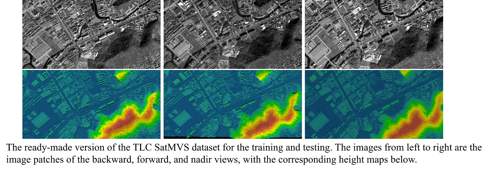

# WHU-TLC dataset

### About the dataset
The dataset is public for MVS (Multi-View Stereo) task in satellite domain, which is consisted of the triple-view satellite images, the RPC parameters and the ground-truth DSMs.
You can download the dataset here: http://gpcv.whu.edu.cn/data/whu_tlc.html.

Second accessible channel for the dataset:

https://pan.baidu.com/s/1d1j2ftQ5pArUyzmdksliRg (code: lcr1)

https://pan.baidu.com/s/1G50LbIxqqbrF7gHv_zw_fg (code: myun)

https://pan.baidu.com/s/14pTt_zNjMa6RuyWqVKcb3A (code: lk46)

https://pan.baidu.com/s/1fOKS6UqiYxgmiR5Vk_jG4A (code: c73k)

### About the images

The triple-view images were collected from the TLC camera mounted on the ZY-3 satellite, a professional satellite for surveying and 3D mapping. The ground resolution of the nadir and the two side-looking images is 2.1 m and 2.5 m, respectively.

The triple-view images were captured at almost the same time, without the impact of illumination and seasonal changes. 

The RPC parameters are already refined in advance to achieve a sub-pixel reprojection accuracy.

### About the DSM

The ground-truth DSMs were prepared from both high-accuracy LiDAR observations and ground control point (GCP)-supported photogrammetric software.  The DSM is stored as a 5-m resolution regular grid under the WGS-84 geodetic coordinate system and the UTM projection coordinate system.

### About the coordinate system

Please **Note** that, the coordinate system has been adjusted to other planets (which means that the coordinate system is non-real). Thus the public DEM (such as SRTM) and the DSM we provide here are completely out of alignment, but the provided DSM can be processed just like the UTM projection.

The projection parameters for the data are listed here:

| **Ellipsoid a**                | **6378137.0**     |
| ------------------------------ | ----------------- |
| **Ellipsoid inv_f**            | **298.257223563** |
| **Latitude of natural origin** | **0**             |
| **Central Meridian**           | **-135**          |
| **scale factor**               | **0.9996**        |
| **False Easting**              | **500000**        |
| **False Northing**             | **0**             |

### What are them?

You can find 3 folders in the dataset: Open, open_dataset and open_dataset_pinhole.

#### Open


This is the first version of the WHU-TLC SatMVS dataset.  It's a collection of large-size satellite images(5120x5120 pixels) with RPC parameters and DSM. It's perfect to do a complete assessment of your pipeline on DSM using this version of dataset.

##### Image: 

**jpg**: visualization of the image

**tif**: the image

**rpc**: the RPC parameters

##### DSM:

**jpg**: visualization of the DSM

**tif**: the DSM

**tfw**: tfw file for the DSM

#### open_dataset

This is the second version of the WHU-TLC SatMVS dataset.  It's a ready-made version for the training and testing of a learning method with mainstream GPU capacity.



**height**: the height maps.

**image**: the image patches.

**rpc**: the RPC parameters for the image patches.

** 0, 1 and 2 represents the three views respectively.

#### open_dataset_pinhole

This is an accessary version of the WHU-TLC SatMVS dataset. We fitted each image patch with the RPC projection into pin-hole projection according to [1] under the UTM coordinate system.

**depth**: the depth maps.

**image**: the image patches after Skew correction.

**camera**: the fitted camera parameters for the image patches.

** 0, 1 and 2 represents the three views respectively.

the camera (.txt) is stored as follows:

```
 0 E00 E01 E02 E03
 1 E10 E11 E12 E13
 2 E20 E21 E22 E23
 3 E30 E31 E32 E33
 4
 5 f(pixel)  x0(pixel)  y0(pixel)
 6
 7 DEPTH_MIN   DEPTH_MAX   DEPTH_INTERVAL
 8 IMAGE_INDEX 0 0 0 0 WIDTH HEIGHT
```

[1] Kai Zhang, Noah Snavely, and Jin Sun. Leveraging vision reconstruction pipelines for satellite imagery. In Proceedings of the IEEE/CVF International Conference on Computer Vision Workshops, pages 2139-2148, 2019.

### Cite

If you have used our dataset in your work, please cite our article:

@InProceedings{Gao_2021_ICCV,
    author    = {Gao, Jian and Liu, Jin and Ji, Shunping},
    title     = {Rational Polynomial Camera Model Warping for Deep Learning Based Satellite Multi-View Stereo Matching},
    booktitle = {Proceedings of the IEEE/CVF International Conference on Computer Vision (ICCV)},
    month     = {October},
    year      = {2021},
    pages     = {6148-6157}
}


