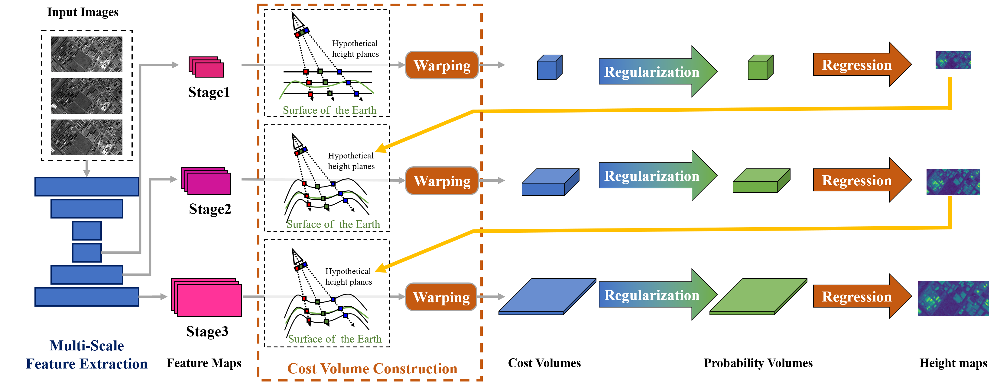

# Sat-MVS: Multi-View Stereo Dense Matching Network for Satellite Images

Official Implementation of ICCV2020:
*Rational Polynomial Camera Model Warping for Deep Learning Based Satellite Multi-View Stereo Matching*

### Requirements

For more details, please refer to environment.yaml. And You can simply import this environment from the yaml file via conda:

`conda env create -f environment.yaml`

`conda activate satmvs`

Some packages are list here:

| package        | version  |
| -------------- | -------- |
| gdal           | 3.3.1    |
| matplotlib     | 3.4.3    |
| numpy          | 1.12.5   |
| tensorboardx   | 2.5      |
| pytorch        | 1.4.0    |
| torchvision    | 0.5.0    |
| numpy-groupies | 0.9.14   |
| opencv-python  | 4.5.5.62 |

### Data Preparation
See [WHU_TLC/readme.md](WHU_TLC/readme.md) for more details. And rename the "open_dataset"  to "open_dataset_rpc".

### Train
Train on WHU-TLC dataset using RPC warping:

`python train.py --mode="train" --model="red" --geo_model="rpc" --dataset_root=[Your dataset root] --batch_size=1 --min_interval=[GSD(resolution of the image)] --gpu_id="0"`

Train on WHU-TLC dataset using homography warping:

`python train.py --mode="train" --model="red" --geo_model="pinhole" --dataset_root=[Your dataset root] --batch_size=1 --min_interval=[GSD(resolution of the image)] --gpu_id="0"`

### Predict
If you want to predict your own dataset, you need to If you want to predict on your own dataset, you need to first organize your dataset into a folder similar to the WHU-TLC dataset. And then run:

`python predict.py --model="red" --geo_model="rpc" --dataset_root=[Your dataset] --loadckpt=[A checkpoint]`

### Citation
If you find this work helpful, please cite our work:
@InProceedings{Sat_MVS,
    author    = {Gao, Jian and Liu, Jin and Ji, Shunping},>
    title     = {Rational Polynomial Camera Model Warping for Deep Learning Based Satellite Multi-View Stereo Matching},
    booktitle = {Proceedings of the IEEE/CVF International Conference on Computer Vision (ICCV)},
    month     = {October},
    year      = {2021},
    pages     = {6148-6157}
}

### Acknowledgements
Thanks to the authors of UCS-Net, Cas-MVSNet, and VisSat (adapted COLMAP) for open sourcing their fantastic projects. You may want to visit these projects at:

https://github.com/touristCheng/UCSNet

https://github.com/alibaba/cascade-stereo

https://github.com/Kai-46/VisSatSatelliteStereo

